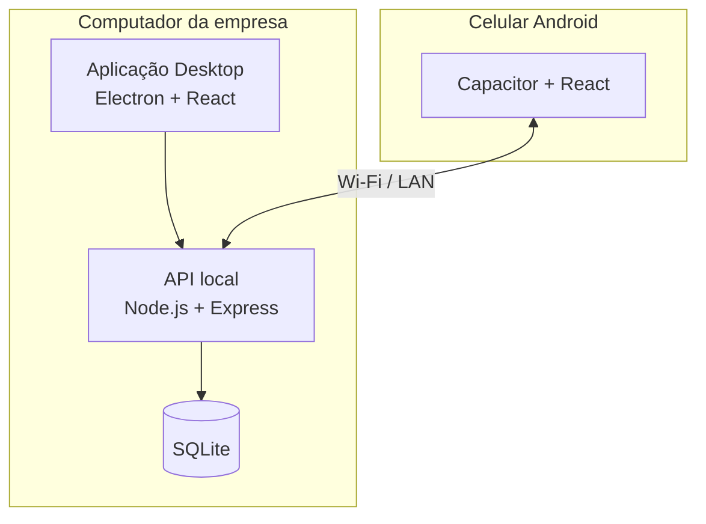

# Diretoria Gestão

> Case técnico de um sistema de gestão Desktop + Android desenvolvido para a operação da **Diretoria Conveniência**.


## Sobre o projeto

O **Diretoria Gestão** nasceu de uma necessidade real: substituir controles manuais de estoque, vendas, caixa e fiados por uma solução simples, centralizada e adequada à rotina do estabelecimento.

A solução foi projetada para funcionar em **Desktop e Android**, utilizando o computador da empresa como servidor local e banco de dados central. O celular acessa os mesmos dados pela rede local, permitindo que a operação continue mesmo quando não há acesso à internet.

Este repositório é um **showcase público** do projeto. O código-fonte completo é mantido em repositório privado.

## Problema

Antes do sistema, parte da operação dependia de controles manuais e informações distribuídas entre diferentes meios. Entre os pontos identificados estavam:

- dificuldade para acompanhar estoque e produtos em falta;
- risco de divergências entre vendas e estoque;
- controle manual de fiados e cobranças;
- registro de caixa pouco centralizado;
- necessidade de consultar informações rapidamente durante o atendimento.

## Solução

O sistema centraliza as principais rotinas da operação em uma única base de dados:

- cadastro de produtos, clientes e fornecedores;
- entradas, saídas e ajustes de estoque;
- PDV e registro de vendas;
- pagamentos em dinheiro, Pix, cartão ou fiado;
- baixa automática de estoque;
- contas a receber e pagamentos parciais de fiados;
- movimentações de caixa;
- relatórios;
- leitura de código de barras;
- integração entre Desktop e Android pela rede local.

## Arquitetura



A principal decisão arquitetural foi manter **uma única fonte de verdade**. O banco SQLite fica no computador, e o aplicativo Android acessa a API local. Assim, não é necessário manter dois bancos nem resolver conflitos de sincronização entre dispositivos.

Mais detalhes em [Arquitetura](docs/arquitetura.md).

## Tecnologias

| Camada | Tecnologias |
| --- | --- |
| Interface | React, TypeScript, Vite |
| Desktop | Electron |
| Mobile | Capacitor, Android |
| Backend | Node.js, Express, TypeScript |
| Banco de dados | SQLite, better-sqlite3 |
| Validação | Zod |
| Código de barras | ZXing |
| Gráficos | Recharts |
| Versionamento | Git e GitHub |

## Funcionalidades atuais

### Operação

- Dashboard com indicadores do dia.
- Cadastro e edição de produtos.
- Controle de estoque.
- Cadastro de clientes.
- Cadastro de fornecedores.
- PDV e lançamento de vendas.
- Venda fiada com geração de conta a receber.
- Recebimento parcial ou total de fiados.
- Entradas e saídas de caixa.
- Relatórios de vendas.
- Persistência da venda em andamento ao navegar pelo sistema.

### Desktop

- Aplicação Electron.
- Banco de dados central.
- API local iniciada junto ao aplicativo.
- Gerenciamento de dispositivos autorizados.
- Suporte a leitor físico de código de barras que emula teclado.
- Exportação de dados em JSON.

### Android

- Aplicativo via Capacitor.
- Leitura de código de barras pela câmera.
- Pareamento com o Desktop.
- Acesso aos dados pela rede local.
- Operação sem dependência de internet, desde que Desktop e celular estejam na mesma rede.

Veja a descrição completa em [Funcionalidades](docs/funcionalidades.md).

## Alguns desafios técnicos

### Um banco para dois ambientes

Manter bancos independentes no Desktop e no celular criaria um problema de sincronização. A solução adotada foi centralizar o SQLite no computador e fazer o Android consumir a mesma API pela LAN.

### Node.js, Electron e módulos nativos

O `better-sqlite3` utiliza código nativo. Como Node.js e Electron podem usar ABIs diferentes, o backend foi separado do processo do Electron e é iniciado usando o Node.js instalado no computador. Isso evita incompatibilidades do módulo nativo sem duplicar a camada de acesso a dados.

### Consistência de uma venda

A finalização da venda envolve várias operações relacionadas. O fluxo utiliza transação no banco para que venda, itens, baixa de estoque e lançamento financeiro sejam confirmados em conjunto.

### Continuidade do atendimento

O carrinho do PDV é preservado durante a navegação para evitar que uma venda em andamento seja perdida ao acessar outra área do sistema.

Mais detalhes em [Decisões técnicas](docs/decisoes-tecnicas.md).

## Estrutura do projeto real

O código privado é organizado como um monorepo:

```text
apps/
├── client/       React + Capacitor
└── desktop/      Electron

packages/
└── server/       Express + SQLite
```

Desktop e Mobile reaproveitam a mesma interface React, enquanto o servidor local concentra regras de negócio e persistência.

## Screenshots

As capturas reais da interface serão adicionadas a este showcase em breve.

> Nenhuma captura publicada aqui deverá conter dados reais de clientes, fornecedores, vendas ou qualquer outra informação operacional da empresa.

## Status

A versão atualmente registrada do projeto é **v0.1.0** e o sistema continua em desenvolvimento.

Entre as próximas evoluções planejadas estão:

- autenticação e níveis de permissão;
- abertura e fechamento de caixa por turno;
- cancelamento e estorno com trilha de auditoria;
- inventário físico;
- backup e restauração;
- instaladores e builds assinados;
- testes automatizados.

Veja o [Roadmap](docs/roadmap.md).

## O que este repositório contém

Este repositório contém somente material de apresentação:

- visão geral do projeto;
- arquitetura;
- funcionalidades;
- decisões técnicas;
- roadmap;
- futuramente, screenshots e demonstrações sem dados reais.

Ele **não contém o código-fonte comercial**, banco de dados ou dados da operação.

## Autor

Desenvolvido por [Leonardo Bilhalva](https://github.com/LeoBilhalva).

---

Projeto em desenvolvimento para um cenário real de operação, com foco em simplicidade, funcionamento local e evolução incremental.
