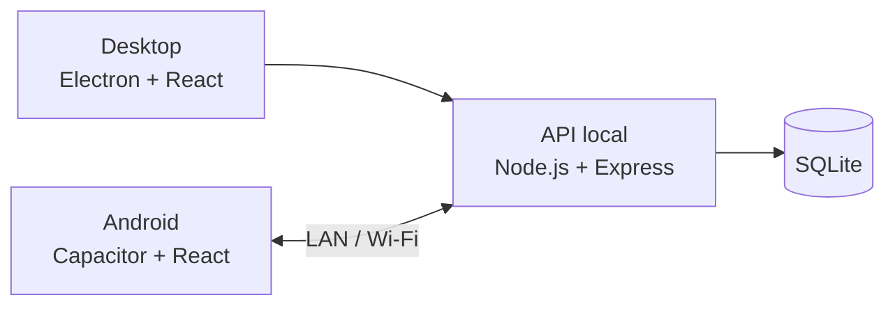
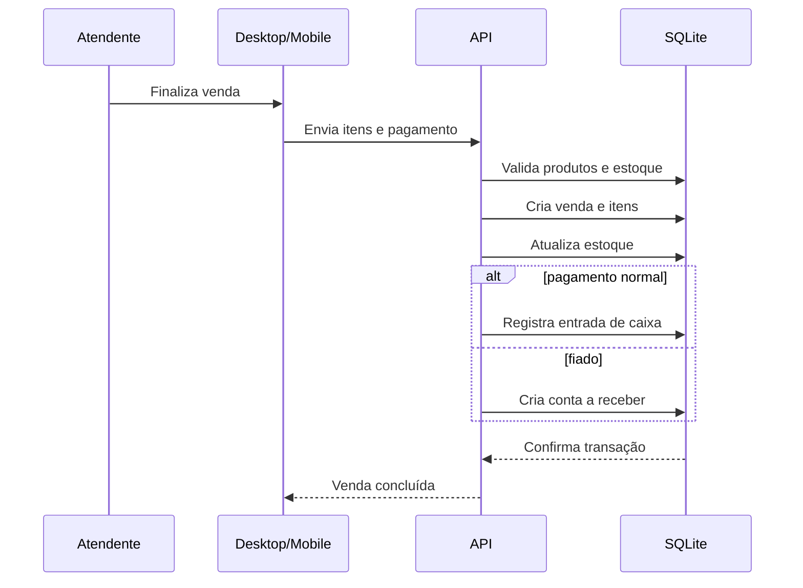

# Arquitetura

## Visão geral

O Diretoria Gestão utiliza uma arquitetura local, com o computador da empresa funcionando como ponto central da operação.

O banco de dados existe apenas no computador. O aplicativo Android consulta e altera os mesmos dados por meio da API local.

## Por que uma base central?

Durante o desenho da solução, uma alternativa seria manter um banco no Desktop e outro no celular. Isso adicionaria sincronização, conflitos e necessidade de definir qual cópia seria autoritativa.

A arquitetura adotada evita esse problema:

- uma única fonte de verdade;
- funcionamento sem internet;
- implantação de baixo custo;
- backup concentrado em um banco principal;
- possibilidade de conectar mais dispositivos no futuro.

## Desktop

O Desktop combina:

- interface React;
- aplicação Electron;
- inicialização da API local;
- acesso ao banco SQLite.

A interface do Desktop se comunica com a API pelo próprio computador.

## Mobile

O aplicativo Android utiliza a mesma interface React empacotada com Capacitor.

O celular:

1. conecta-se ao Desktop pela rede local;
2. é pareado com o sistema;
3. recebe autorização de acesso;
4. passa a consumir a API central.

Não existe uma segunda base de dados autoritativa no celular.

## Persistência

O banco utiliza SQLite com recursos adequados às operações críticas do sistema, incluindo:

- chaves estrangeiras;
- WAL;
- índices;
- transações.

## Fluxo simplificado de venda

As etapas relacionadas são tratadas em conjunto para reduzir o risco de uma venda ser registrada sem a respectiva atualização de estoque ou financeiro.

## Escopo de rede

A solução foi pensada para uso dentro da rede privada do estabelecimento. A internet não é requisito para a operação diária; Desktop e celular precisam apenas conseguir se comunicar pelo mesmo roteador.

## Evolução prevista

Para uma versão mais ampla/comercial, a arquitetura poderá receber camadas adicionais de autenticação, permissões, backup automatizado, distribuição de atualizações e proteção de transporte.
